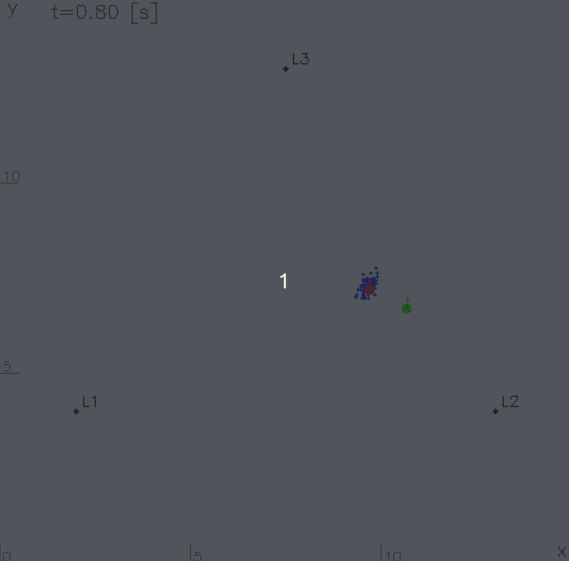

# Simple Monte Carlo Localization

基本的な Monte Carlo Localization (MCL) の実装です．
ランドマークまでの距離に基づく観測モデルと，
差動駆動型ロボットを想定したオドメトリ運動モデルを用い，
パーティクルフィルタによりロボットの姿勢を推定します．

単純な旋回運動を与えたシミュレーションにより推定挙動を確認でき，
各時間ステップにおける推定姿勢などを CSV に記録します．



+ 青: パーティクル
+ 緑: 姿勢の真値
+ 赤: 姿勢の推定値
+ 黒: ランドマーク (L1, L2, L3)


## Tested environment

+ OS: Ubuntu 22.04 LTS
+ Compiler: g++ 11.4.0
+ CMake: 3.22.1
+ OpenCV: 4.5.4


## Install & Build & Run

```bash
git clone https://github.com/nacky823/simple_mcl.git
cd simple_mcl && make
```
```bash
./build/simple_mcl
```
